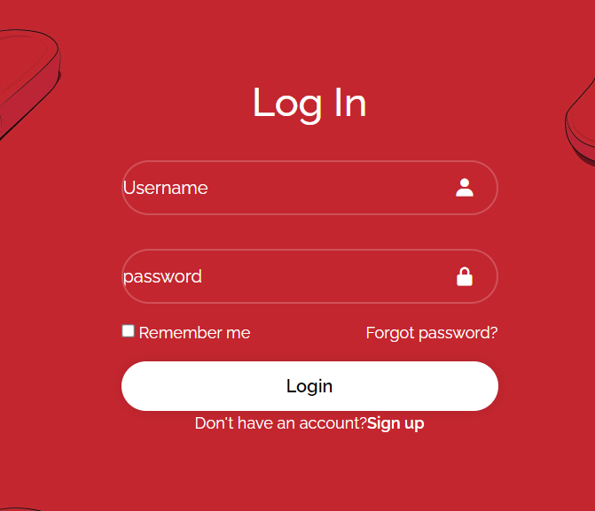
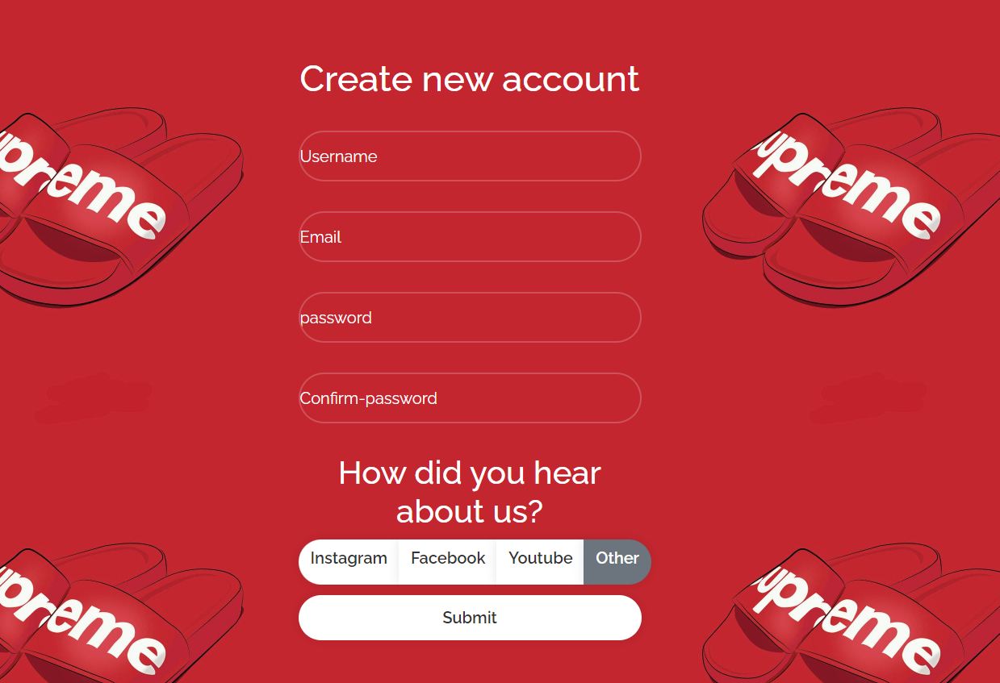
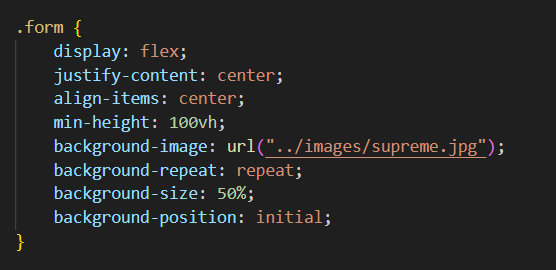
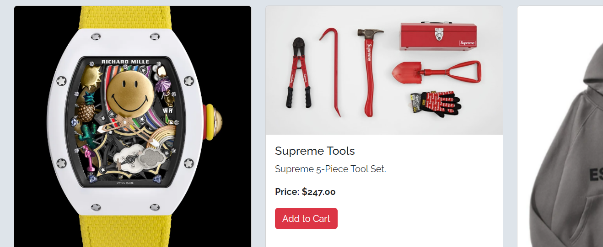
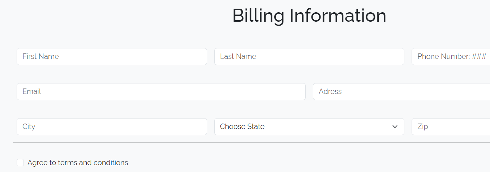

# ArbitraryDrip

Arbitray Drip is an E-commerce website that sells random products and can range from anything that your mind can fathom. It is based on the concept of Clout. Clout /klout/ noun. influence or power, especially in politics or business.

## Description

This website was created using: HTML, CSS, and Bootstrap. 

### Pages

In the description section I will explain an in-depth paragraph about my project and overview of use. As you can see by the image provided I will first talk about the Home page. 

##### Home page

The Home page I kept basic with just an image covering the Home page with a brief explanation of my website; You'll see what I mean when you visit my website. 

##### Login

Once you click the Login tab on the navbar you will be prompted with a login validation form. I made a simple login form to be able to login and also with an option to Sign up/ create an account. Once you click sign up, you as the user will be redirected to a Sign up page with a sign up form if you don't already have an account. 

##### Sign Up

Under the Sign Up form I added a form where the user can input information regarding a username they would like to add, and following fields such as email, and password/ password-confirmation. I've also added four radio buttons which help to answer our question as to how the user heard about our website. Lastly I added a submit button which won't allow the user to continue if they left a field blank.

For the Sign Up page I wanted to use a background, but I wanted to use a background that repeated and was funky looking yet pleasing. I accomplised this effect by playing with the background-image. I did this as follows. 

##### Products

In the Products tab I have added multiple items that pertain to my what Arbitrary Drip is all about. Feel free to browse. I've also added buttons to simulate the user adding items to thier cart. 

##### Cart

Lastly I have added a form and table to where the user can input needed information and can also see the items they have in their cart. 

## Author

 [Martin Enriquez](https://github.com/TherealJGatsby) 

## Acknowledgments 

 [Bootstrap](https://getbootstrap.com/docs/4.1/components/forms/#inline-forms)
 [Box Icons](https://boxicons.com/)

 